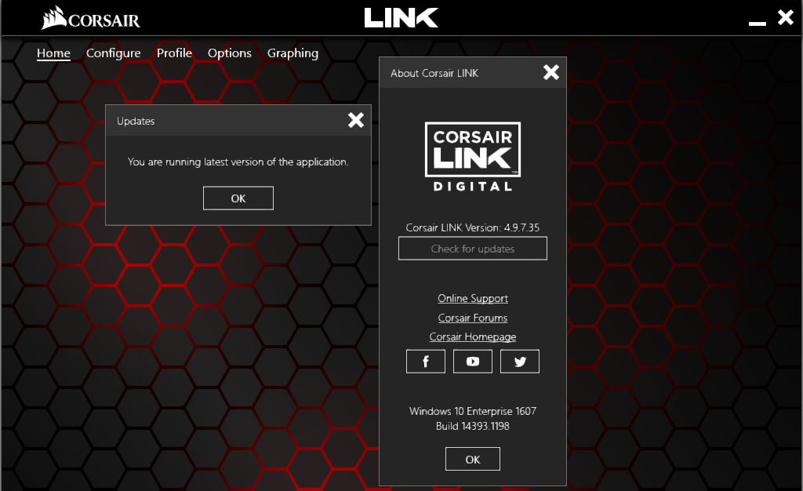
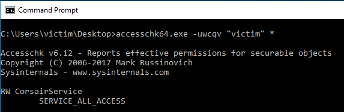

# Unprivilaged to System with the Corsair Link 4 and Corsair iCUE

## Disclosure
* 2018/12/07 - No Corsair Bug Bounty program Idenitifed.
* 2018/12/07 - Reached out to Corsair via Customer Support (Ticket #819734)
* 2018/12/12 - Advised by Corsair rep that they have no bug bounty program, advised to submit to buisness sales... 
* 2018/12/12 - Reaching out to Corsair developer over twitter, may actually get somewhere.
* 12/12/2018 - Added iCUE details

## Summary 
The [Corsair Link](https://www.corsair.com/eu/en/corsairlink) and [Corsair iCUE](https://www.corsair.com/eu/en/icue) platforms, used to manage Corsair hardware via the Operating System, create a system service that can be accessed and modified to allow an unprivilaged user to perform a privilage escalation attack. This can be used to attain Administrative, or System Level access if chained.

## Vulnerability Impact
* This attack would allow a malicious user to gain privileged access to a compromised host.
    * https://attack.mitre.org/techniques/T1058/

* This is a local privilege escalation, and will not perform the initial compromise of a host. 

## Proof Of Concept

> A video for this Proof Of Concept can be found here: https://drive.google.com/open?id=1Bw7e_ccTFAs_caPb-1ENxy28CHoqgyOp

The scenario starts with an attacker having gained access to a victim host, be this via direct exploitation, phishing, drive by or any other exploitative method.

The machine we are attacking has two user accounts:

* `user` an administrative account
* `victim` an unprivilaged account

The Corsair LINK v4.9.7.35 is also installed.

The administrative user group is in this state:

The vulnerabliltiy presented by the Corsair Link 4 is in its Service configuration, we can use the `Accesschk64.exe` binary from Windows Sysinternals to detect this weakness:

`> accesschk64.exe -uwcqv "victim" *`

The output of this command shows us that we have full access to the service named `CLink4Service`. This means we can modify the configuration of this service. Maybe it can do something for us!

If we take a look at the service itself we can see several things we may be able to take advantage of. 

Firstly and importantly the `SERVICE_START_NAME : LocalSystem` value shows us that this service will run under `NT AUTHORITY\SYSTEM` user and privileges. Secondly the `START_TYPE` being set to Demand Start, means that the service is requested to start when it begins, we can modify this to automatically start and run whatever the service binary is.

Our next step is to stop the service using the windows service control:

`> sc stop "CLink4Service"`

> The service start and stop was problematic here, due to the service not properly accepting control codes. in the example video I need to reboot the host.

We can then then procede to start modifying the service to our needs:

This changes the service binary to the net command:

`net localgroup administrators victim /add` which will add a user to the local administrators group when run, additionally we specified `start= Auto` so that the service will start automatically when the system starts up

Then we can just start the service up again!

`> sc start "CLink4Service"`

> As above this was a pain beuacse the service didnt respond to control codes correctly, so we had to restart the system.

We can now see that our unprivilaged user, is part of the administrators group!

As far as a perfect Privilege Escalation goes, we've got admin on the box, but lets use another bypass to get system, just beacuse we can!

We're going to replace the Accessabilities Utility with the command processor which will give us this!

First we need to take ownership of the target file, super simple: `takeown /F Utilman.exe`

We need to do this from an elevated command prompt, but since we're in the admin group we can use our own credentials to achieve this.

Because of the permissions on `Utilman.exe` we need to grant ourselves rights to modify it, as we are the owner we can do this using `icacls`:

Finally we literally just copy `cmd.exe` over `utilman.exe` and thats it.

Last step is the easiest, we just logout and select the utilities manager at the login screen!

If for whatever reason you absolutely needed SYSTEM level access, you now have it.

## Corsair iCUE 

The same issue is present in the iCUE service:

